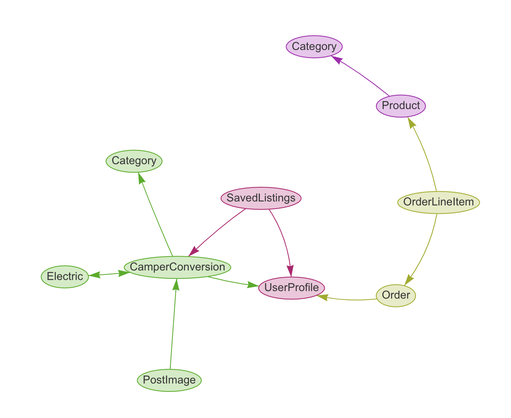

# Wild Mile Conversions
## Code Institute: Milestone Project 4 - Jamie Rolls


A live version of the site is available [here.](https://wild-mile-ms4.herokuapp.com/)

Wild Mile Conversions is a site dedicated to the advertisement of bespoke vehicle conversions for leisure and business. Listings are added by site users, with the aim to attract buyers and complete a selling transaction off-site. Users purchase a listing fee to advertise on the site. Wild Mile merchansise is also available for purchase. The site is designed to be easy to navigate, promotes ease of use and have intuitive features for both buyers and sellers to enhance the user experience.

#### **Project Requirements:**
Build a full-stack site based around business logic used to control a centrally-owned dataset. Set up an authentication mechanism and provide paid access to the site's data and/or other activities based on the dataset, such as the purchase of a product/service.

Required Technologies : 
* HTML, CSS, JavaScript, Django + Django
* Relational database (MySQL or Postgres)
* Stripe Payments - Test card details can be found [HERE](#test-card)

Optional: Include use of additional libraries and external APIs.

#### Mandatory Requirements

1. Django Full Stack Project: Build a Django project backend by a relational database to create a website that allows users to store and manipulate data records about a particular domain.
2. Multiple Apps: The project must be a brand new Django project, composed of multiple apps (an app for each potentially reusable component in your project).
3. Data Modeling: Put some effort into designing a relational database schema well-suited for your domain. Make sure to put some thought into the relationships between entities. Create at least 2 custom django models beyond the examples shown on the course
4. User Authentication: The project should include an authentication mechanism, allowing a user to register and log in, and there should be a good reason as to why the users would need to do so. e.g., a user would have to register to persist their shopping cart between sessions (otherwise it would be lost).
5. User Interaction: Include at least one form with validation that will allow users to create and edit models in the backend (in addition to the authentication mechanism).
6. Use of Stripe: At least one of your Django apps should contain some e-commerce functionality using Stripe. This may be a shopping cart checkout or single payments, or donations, etc. After paying successfully, the user would then gain access to additional functionality/content on the site. Note that for this project you should use Stripe's test functionality, rather than actual live payments.
7. Structure and Navigation: Incorporate a main navigation menu and structured layout (you might want to use Bootstrap to accomplish this).
8. Use of JavaScript: The frontend should contain some JavaScript logic you have written to enhance the user experience.
9. Documentation: Write a README.md file for your project that explains what the project does and the value that it provides to its users.
10. Version Control: Use Git & GitHub for version control.
11. Attribution: Maintain clear separation between code written by you and code from external sources (e.g. libraries or tutorials). Attribute any code from external sources to its source via comments above the code and (for larger dependencies) in the README.
12. Deployment: Deploy the final version of your code to a hosting platform such as Heroku.
13. Security: Make sure to not include any passwords or secret keys in the project repository. Make sure to turn off the Django DEBUG mode, which could expose secrets.

# Table of Contents

1.  [Strategy & Scope](#strategy-and-scope)
    * [UX](#ux)
        * [Business Objectives](#business-objectives)
        * [User Objectives](#user-objectives)
        * [Project goals](#project-goals)
        * [User Stories](#user-stories)
2.  [Structure](#structure)
    * [Design Process](#design-process)
        * [Page Structure](#page-structure)
        * [Page Summaries](#page-summaries)
        * [Django Apps](#django-apps)
        * [Database Design & Structure](#database-design-and-structure)
3.  [Surface](#surface)
    * [Colors](#colours)
    * [Fonts](#font-choice)
4.  [Skeleton](#skeleton)
    * [Wireframe Designs](#wireframe-designs)
    * [Final Project Design Differences](#wireframe-and-final-project-differences)
    * [Responsive Design](#responsive-page-design)
5.  [Features](#features)
    * [Sitewide](#sitewide)
        * [Navbar](#nav-bar)
        * [Banner](#banner)
        * [Footer](#footer)
    * [Homepage](#homepage)
    * [Conversions](#conversions)
        * [Conversion Detail](#conversion-detail)
    * [Add Conversion](#add-conversion)
    * [Edit Conversion](#edit-conversion)
    * [Add Conversion Pricing](#add-conversion-pricing)
    * [Merchandise](#merchandise)
        * [Product Detail](#product-detail)
    * [Shopping Bag](#shopping-bag)
    * [Checkout](#checkout)
        * [Checkout Success](#checkout-success)
    * [FAQ](#faq)
    * [Profile](#profile)
        * [Order History](#order-history)
        * [My Listings](#my-listings)
        * [Saved Listings](#saved-listings)
    * [Conversion Management](#conversion-management)
        * [Approve Conversions](#approve-conversions)
    * [Add Product](#add-product)
    * [Edit Product](#edit-product)
    * [Authentication](#authentication)
6.  [Future Features](#future-features)
7.  [Technologies Used](#technologies-used)
8.  [Testing](#testing)
9. [Deployment](#deployment)
    * [Hosting on Heroku](#hosting-on-heroku)
    * [Cloning](#cloning)
10. [Credits](#credits)
    * [Content](#content)
    * [Media](#media)
        * [Images](#images)
    * [Acknowledgements](#acknowledgements)
        * [Sites used](#sites-used-for-information-and-support)
        * [Advice & Support](#i-received-advice-and-support-from)


# Strategy and Scope
## UX

#### Business Objectives
- The aim of Wild Mile Conversions is to create a web-based platform that enables the buying and selling of all sorts of unique, interesting and alternative conversions such as (but not limited to!) campervans, mobile bars and catering. 
- The site will generate revenue from people that wish to list/advertise their converted vehicle on the platform. Revenue will also be generated from selling Wild Mile merchandise.
- The site will only allow self- converted and vintage vehicles, or unique base vehicles ready for conversion - to be listed. This will be managed by an approval process before listings become live on the site.
- The site will provide sellers, with a unique opportunity to advertise to a large group of a specific target audience.
- The site will be easy to navigate, all features will be clear to a user.
- Social media channels will be present on the footer, to attract site visitors to join the growing community of 'Wild Mile' enthusiasts.

#### User Objectives

- Users may be using the site to find bespoke conversions, as potential buyers.
- Users may like to list/advertise a conversion for sale on the site, this should be easily acheived with a clear, straightforward method.
- Users may like to purchase 'Wild Mile' merchandise using the site. The store should make this easy, with clear pricing and checkout functionality.

#### Project Goals

- Create a clear, well-designed website for the user to navigate with ease.
- Use a consistent, clear theme throughout the site.
- Consider appropriate pages/layout and content to fulfil business/user objectives/user stories.
- Design models and integrate a relational database into the web app using SQlite + Django, transfer this to Postgres during deployment. The database will store conversion listings, merchandise products, user profiles.
- Consider user authentication, to allow/enable the following actions & features: -
    * Creation of a user profile
    * Save Default delivery information
    * View order history
    * Add/Edit a conversion listing
    * Save/Favorite listings to profile
    * Admin features
        * Edit, delete, approve conversion listings
        * Edit, delete and add merchandise products

- Fulfil all mandatory project minimum requirements. (these are listed [HERE](#mandatory-requirements))

#### User Stories

An overview of user stories is displayed below:

##### Buying:

- Visitors will be able to purchase ‘Wild Mile’ merchandise from the site directly.
- Registered users will be able to request contact with sellers to make purchases of conversions.
- Registered users may save / favorite listings to their profile

#### Sellers:
	
- Users will be able to list their conversion onto the site for sale.
- Requests to list will be via an online form, which will gather all required information and includes a photo file upload service.
- A fee will be charged to list an item for a specified length of time.
- Once the fee is paid, the submission is reviewed by and authorised by the site admin, prior to publishing. At which point the listing duration commences.
- Sellers can edit or delete their listings

#### Admin:

- Ability to manage listings, edit and delete.
- Ability to add merchandise listings to the site, edit and delete as required.
- Ability to review listing submissions and approve the publishing of them to the site.

### A detailed list of over 30 specific user stories has been complied to help steer the design process.
 * The list can be viewed using this link to a Google Drive Sheets file - [User Stories](https://docs.google.com/spreadsheets/d/1g_SrmtPI9fuqDBbD-NZnR5lpJLmGJHU5aqLjB80KybA/edit?usp=sharing)

<div align="right">
    <a href="#table-of-contents"> ⇧ Back To Top </a>
</div>

# Structure

## Design Process

## Page Structure

* The site is designed to feel familar throughout it's pages in style and functionality. It contains straight-forward navigation elements, further filtering/manipulation of site content can be completed within individual pages by utilising features such as search, filter and multiple pages. This design allows users to quickly and easily engage with and locate relevant content from within the site.

* The site theme and code was developed from the ground up, with elements of the site layout inspired from 'boutique-ado' mini project that was put together during the teaching/learning of the 'Code Institute - Software Developer' course.
            
* To maintain familarity between pages and improve site usability, the filter and sort elements implemented accross the site are displayed and work in the same way throughout the site.

* Research into optimal page layouts was conducted accross various sites/businesses which advertise/list products. The research helped to develop page layouts which present information clearly to the user accross multiple devices sizes with success.

* To support [User Stories](https://docs.google.com/spreadsheets/d/1g_SrmtPI9fuqDBbD-NZnR5lpJLmGJHU5aqLjB80KybA/edit?usp=sharing) and taking input from research, the following pages were chosen to be created:

    ##### Home - Landing Page

    ##### Conversions Page ----- Conversion Detail Page

    ##### Add Conversion Page

    ##### Edit Conversion Page

    ##### Conversion Listing Prices Page

    ##### Merchandise Page ----- Product Detail Page

    ##### Shopping Bag Page ----- Checkout Page ----- Checkout Success Page

    ##### About Page

    ##### FAQ Page

    ##### Profile Page ----- Order History Page ----- My Listings Page ----- Saved Listings ----- Message Portal

    ##### Conversion Management Page ----- Approve Conversions Page

    ##### Add Product/Merch Page

    ##### Edit Product/Merch Page

    ##### Authentication Pages (allauth templates - styled)
    
* The navbar, present on all pages will contain the following navigation links :
    - Home
    - Buy a conversion (dropdown) ----- All conversions ----- Campervans ----- Mobile Bars and Catering Vans
    - Sell a conversion (dropdown) ----- View Pricing ----- Add a conversion
    - Merchandise (dropdown) ----- All Products ----- Clothing ----- Stickers ------ Mugs
    - About Us
    - Faq

* Accompanying the navbar, a 'My Account' and 'Shopping Bag' button will be present on all pages:
    * My Account (dropdown) ----- Register ----- Login / My Profile ----- Logout

    * My Account for admin/superuser with contain addition navlinks when logged in:
        * Product Management
        * Conversion Listing Management
    
    * Shopping Bag is a direct link to the shopping bag template

* A search bar will be present on all pages - this takes a user query and returns the conversions template displaying only relevant matches. The specified search query is used as a filter against the title and description of all live listings.

* The site footer will contain social media icons, which link the user to the relevant social platform in a new browser/tab.

## Page summaries

#### Home Landing Page

* The home page will contain a button to view all conversions with the company name and business summary.

#### Conversions Page

* The all conversions page (conversions.html) will dynamically show conversions from the database, based on search terms or filters which have been applied.

#### Conversion Detail Page

* The conversion detail page will display the content/data for one listing, including contact information for the seller.
#### Add Conversion Page

* The add conversion page will render a form, which can be filled in to submit a listing to the site including photo file upload. The page will also contain directions for the user to support the user experience.

#### Edit Conversion Page

* The edit conversion page will render the same form as 'add conversion', but it will be populated with an instance of a specified listing. The user will be able to update the content, clear or update photo file content.

#### Add Conversion Pricing Page

* The conversion pricing page will outline the different listing tokens which can be purchased. The elements displaying this information will link to their respective product page, so that a user may add it to their shopping bag and checkout to purchase a listing token.

#### Merchandise Page

* The merchandise page (products.html) will dynamically show products from the database, based on category filters which have been applied.

#### Product Detail Page

* The product detail page will display the content/data for one product, including the functionality to add the product to the shopping bag so that a user may checkout and purchase the item.

#### Shopping Bag Page

* The shopping bag will render all products in the session bag. It will contain links to checkout - to allow the user to complete purchase of bag items.

#### Checkout Page

* The checkout page will allow users to review and complete the order, add delivery and payment details.

#### Checkout Success Page

* The checkout success page will render the completed order information and provide user feedback.

#### About Us Page

* The about us page will display information about the business and its owners.

#### FAQ Page

* The FAQ page will render some questions and answers which are most common to site users.

#### Profile Page

* The profile page will contain a host of links to other registered site features, as well as the users default delivery information which can be updated.

#### Order History Page

* This page will display all previous orders associated with the logged in user profile.

#### My Listings Page

* The My listings page will display any listings that the user has added to the platform, allowing users to edit or delete listings as required.

#### Saved Listings Page

* The saved listings page will render any listings the user has chosed to save/favorite whilst browsing the site.

#### Message Portal Page

* The message portal is a future feature that will allow users to communicate between themselves using the 'Wild Mile' platform.

#### Conversion Management Page

* This page will render a summary of all active listings and allow the ability to view, edit, delete, unlist as required.

#### Approve Conversion Page

* This page will render a summary of all inactive listings and allow the ability to view, edit, delete, make active as required.

#### Add Product Page

* The add product page will render a form, the form allows products to be added to the merchandise section of the site.

#### Authentication Pages

* Various authentication pages, login, logout, register ... and other associated will be provided from the allauth library.


## Django Apps

The Wild Mile WebApp consists of 6 Django applications that host the main site features.

- 'home'
- 'conversions'
- 'products'
- 'profiles'
- 'bag'
- 'checkout'

Other installed apps supporting the site features are: 
- 'crispy_forms'
- 'smartfields'
- 'storages'
- 'allauth'

## Database Design and structure

Database design and structure is handled through the creation of Models using Django. 

The diagram below was created using : django-schema-graph-1.2.0

It shows the relationship between the database/models in its simplest form. Further detail can be found below this diagram.



The following main models have been designed for this project:

* Conversions - 4 Models - Detail can be viewed in the GitHub Repo at this path = /workspace/ms4-wild-mile/conversions/models.py

    1. Main conversion model, containing all conversion data fields, a foreignkey linking to a userprofile, a uuid field to generate a random unique identifier and an 'is_active' boolean field to manage active listings.
    
    2. Category model, used by admin to add future category options to the site. Serves as a foreignkey to the conversion model.
    
    3. Electrics model, used by admin to add or remove options for users to select during the listing process. Serves as a M2M Field in the conversion model.
    
    4. PostImage model, created for the functionality of additional image uploading. This model has a foreign key relating back to the main conversion model.

* Orders - 2 Models - Detail can be viewed in the GitHub Repo at this path = /workspace/ms4-wild-mile/checkout/models.py

    1. Order model, handle orders for the store, all order information including payment and delivery, foreignkey to userprofile.

    2. Order Line Item model, foreignkey to order model and product model, used to record individual order items.

* Products - 2 Models - Detail can be viewed in the GitHub Repo at this path = /workspace/ms4-wild-mile/products/models.py

    1. Category model, used by admin to add future category options to the site. Serves as a foreignkey to the product model.

    2. Product model, foreignkey to category, contains all product information fields.

* Profiles - 2 Models - Detail can be viewed in the GitHub Repo at this path = /workspace/ms4-wild-mile/checkout/models.py

    1. User Profile model, contains a OneToOneField to the django User model from django.contrib.auth.models, as well as default delivery information.
    
    2. Saved Listings model, foreignkeys to both user and conversion models. Used to assign saved/favorite listings to users.

<div align="right">
    <a href="#table-of-contents"> ⇧ Back To Top </a>
</div>

# Surface

## Colours

Colour Palette - Three main colours that compliment the design of the site are:

 -  - `#363E46` - Main Site Body
 -  - `#263d41` - Information Banner
 -  - `#627072` - Page buttons, card background

* Other various shades of grey are used with white to highlight, surround and drop shadows on elements throughout the site.
* The main colour was chosen to represent the road and take some relvance to the company name.


## Font Choice

The following fonts were applied to the site. 

- pwscratchedfont - Used for conversion listing titles and home page brand title.
    - The hand drawn style of the font works well to bring the concept of creativity forward.
    - https://www.dafont.com/pwscratchedfont.font
    - A webfontkit was generated using this font - to maximize compatibility between browsers -  - https://www.fontsquirrel.com/tools/webfont-generator

- Raleway - Used throughout the site as main parent font.
    - The clean, modern look compliments the dark backgrounds and theme of the site.

<div align="right">
    <a href="#table-of-contents"> ⇧ Back To Top </a>
</div>

# Skeleton

## Wireframe designs

Wireframes were designed using Figma, for three primary breakpoints - Desktop, Tablet and Mobile.

- [Figma Wireframes](https://www.figma.com/file/UHdbvOVwqO7qNSWGQC7sWG/MS4-WILD-MILE?node-id=0%3A1)


## Wireframe and Final Project Differences
    
- Profile Page
    * It was decided that the 'Message Portal' would remain a future feature of the site. This allowed increased focus on mandatory requirements of the project.
    * Saved listings link was added to the profile page.
   
- Conversions Page
    * Category filtering was added to the top of the page, to allow users to view only listings from specific categories.
    * Several images were added inside a carousel element for each listing on the page. This allowed users to see more of the conversion without having to enter the conversion detail page.
    * View Details and Save to profile buttons were added to each listing summary, to increase functionality.
  
- Conversion Detail Page
    * More content sections added to support required conversion data - electrics, beds, etc....
    * Display 6 images in varying size, within a CSS grid.
    * Added a carousel of images at the bottom of the page, for image counts larger that 6 photos. On mobile, all images are in the carousel.
    
- FAQ Page
    * Display questions in two columns on desktop devices, as opposed to the wireframe displaying a single column.

- Merchandise Page
    * Category filtering was added to the top of the page, to allow users to view only listings from specific categories.
    * Add sorting to products (price, name, category), to allow users to easily manipulate the content as desired.
    * Add edit and delete buttons for superuser/admin for each product.
    * Display 4 products per row on desktop.
    * Display product information in card footer - with defined background.
   
- Product Detail Page
    * Removed background colour for product information, made all text white.
    * Removed carousel, as only single images for products present.
   
## Responsive Page Design

The site has been designed to operate well on all screen sizes. Special care has been taken to ensure site content and layouts support a positive user experience. Bootstrap responsive classes are used to acheive this and are referenced in the terminology below.

- Home page
    * Font sizes, text breaks and padding and margin is adjusted for smaller devices to maintain clarity and a positive user experience.

- Conversions Page
    * Listing images stack above the listing summary at the medium breakpoint and below.
    * Filter and sort controls centralise at the medium breakpoint and below.

- Conversion Detail
    * All content is stacked to a single column for breakpoints medium and below.
    * All photos are displayed in a responsive carousel with user controls at the medium breakpoint and below, the CSS grid image gallery is hidden.

- Conversion Listing Prices Page
    * The three card elements stack into a single column at the medium breakpoint and below.

- Merchandise Page
    * Products are displayed in rows of 4 (xl), 3 (lg), 2 (m) & 1 (sm) based on the respective devices screen size 
    *  Filter and sort controls centralise at the medium breakpoint and below.
    
- Product Detail Page
    * The product image stacks at the medium breakpoint and below, above the product information.
    * For large devices, the two columns occupy only 4 parts of the grid, an offset of 2 is added to the image container to maintain proportions. This design helps bring content to the center of the screen.

- Shopping Bag Page
    * The shopping bag displays a table with order information to the user at medium breakpoints and above.
    * At smaller breakpoints the table is hidden and the table content is rendered to the page using the Bootstrap grid, not in the constraints of a HTML table. This allows the information to be better displayed and styled on the smaller device size, resulting in a better user experience.
    
- Checkout Page
    * The shopping bag content stacks above the delivery and payment details at medium breakpoint and below. This makes best use of screen space and allows for the delivery and payment elements to remain clear and legible on mobile devices.

- About Page
    * The two column layout stacks into a single column at the medium breakpoint and below.

- FAQ Page
    * The two column layout stacks into a single column at the medium breakpoint and below.

- Profile Page 
    * The profile navigation links stack above the default delivery information at the large breakpoint and below. Resulting in better use of space on mobile and tablet.

- My Listings / Saved Listings
    * The three card elements stack into a single column at the medium breakpoint and below.

- Authentication Pages 
    * The main column containing the allauth form/data occupies full width (12) at the medium breakpoint and smaller. Otherwise it's set at 6, at the left of the screen. The right hand column is empty space.

<div align="right">
    <a href="#table-of-contents"> ⇧ Back To Top </a>
</div>

# Features

## Sitewide

### Nav Bar
* The navbar collapses at the Bootstrap medium breakpoint and below. It can be expanded by clicking the collapsed nav icon to access the navlinks.
* Main nav items have a hover effect active, which displays a short white underline below each nav item.
* Dropdown nav items have a hover effect which changes their text colour to white and changes the background color to the dark green used in the site banner.

### Banner
* The site banner features a marquee element which displays scrolling text accross the viewport. For the context of this project, it is conveying key business messages/offers to site users.

### Footer
* The footer contains social media links and is at the bottom of each page.

## Homepage
* The home page features a call to action button which is labelled 'SEE CONVERSIONS'. This button when clicked, will render the conversions.html template. Displaying all active conversion listings to the user.

## Conversions
* The conversions page handles search terms, categories and sorting to provide users with a fully customisable experience when browsing conversions on the site.
* Conversion category can be selected by clicking one of the category buttons, which will filter the results respectively.
* The selected category button increases in size relative to the others, to indicate the selected category.
* Sorting of conversions by Price, Name & Category is possible with the sort by dropdown menu.
* A dynamically coded text caption, below the category buttons lets the user know the number of conversions that have been found from the database. This updates if a user changes category or submits a search term.
* Pagination is set to return four listings per page. Page controls are present below the fourth conversion listing.
* A return to top arrow is present at the bottom righthand area of the page. It remains in place as the user browses the page.
* Users can engage with the image carousel on each returned listing by using the navigation arrows within the carousel element, the carousel displays three images per listing.
* To view the conversion detail, users can click the carousel, listing title or the 'view details' button, to render the respective conversion_detail.html template.
* A save to profile button will save the respective conversion to the users 'Saved Listings' in thier profile. If the user is not logged it, they will be redirected to the sign in page.

## Conversion Detail
* The conversion_detail page features a contact seller button directly below the vehicle description. When this button is clicked, contact information appears below it for the seller.
* A save to profile button is featured next to the 'contact seller' button. This saves the respective conversion to the users 'Saved Listings' in their profile. As above, if the user isn't logged in they will be redirected to the sign in page.
* The image carousel at the top of the page features all images, the user can use the controls to scroll between previous and next images.
* The image gallery at the bottom of the page consists of two parts. 
    1. A 6 image CSS Grid (only renders min-width: 768px)
    2. An image carousel with user controls (only renders for listings with 6+ images: min-width:768px, renders all images within the carouse: max-width:767px)
* Borders and column offsets are utilized for the largest viewport to bring content into the middle of the screen -  min-width:1200px
* If a conversion listing that is no longer active is requested to render within the template :
    1. The template will render a message to the user - informing them the listing is no longer available. 
    2. If the request is made by the listing creator or a superuser :
        * The template will render a small message at the top of the page informing the user 'this listing is not live' - the listing content will render below this message.

## Add Conversion
* This page is protected with a login decorator, it requires users to be authorised and logged in to view. Otherwise redirects to the sign in page.
* The form has been rendered using django crispy forms. With custom layout and custom labels.
* Users may upload a main image, which is captured in the conversion model. As well as an additional 5 images using the PostForm model. (Further images may be added to listings later using the edit conversion template)
* Once a listing is saved, it is available to view, edit or delete in the users 'My Listings' area of their profile.


## Edit Conversion
* The form rendered on this page is the same as the add_conversion template, detailed above. The same features and validation remain.
* In addition to the points above, the form self populates with an instance of a conversion listing, including all the images associated with the listing.
* Users may delete previously uploaded images, overwrite images and upload upto three additional images.
* Each time the form is accessed, three new empty 'choose file' fields will render.

## Add Conversion Pricing
* Links are currently diabled for 'paid' listing tokens.
* The standard listing token is currently set as 'free - £0.00'. When clicked, the user is directed to a product detail page, rendering the listing token details. 

## Merchandise
* Sorting of conversions by Price, Rating, Name & Category is possible with the sort by dropdown menu.
* Product category can be selected by clicking one of the category buttons, which will filter the products to display only items in the selected category. 
* The selected category button increases in size relative to the others, to indicate the selected category.
* A text caption, below the category buttons lets the user know the number of products that have been found in the selected category.
* Site admin and superusers will see 'edit' and 'delete' buttons, within the footer of each product card.
* Only merchandise products will display, listing tokens are not displayed on this template. This is acheived by removing specific SKUs from rendering on this page with conditional HTML code.

## Product Detail
* Products with sizes render a dropdown menu for users to select a size.
* Lising token products will render a dropdown menu for users to select from any inactive listings associated with their profile. Add to bag button will only be enabled if there is a listing selected.
* Images can be clicked to render full screen in a new tab.
* Site admin and superusers will see 'edit' and 'delete' buttons, to the right of each product rating.
* Quantity buttons can't be decreased below 1.
    * If the product is a listing token, quantity is set to 1. No quantity adjustment buttons will render to the page.

## Shopping Bag
* The shopping bag will allow users to adjust the quantity of bag items and update the bag. Users will also be able to remove bag items completely.
* When update or remove buttons are clicked, the bag will refresh with any updated totals and delivery costs.
* Two buttons at the bottom of the page give the users choice to: 
    1. Keep shopping (back to products)
    2. Secure checkout (renders checkout page)

## Checkout
* If the bag total is £0.00 (purchase of listing token only), a separate template will render (checkout_free.html) without payment elements.
* The checkout template will self populate default delivery information if this is present and set in the user profile.
* Users may check the 'save my delivery information to my profile' checkbox, to update or add this information to their profile.
* A Stripe payment element will render below the delivery information form. With appropriate Stripe validation.
* Stripe Test transaction details:
### Test Card
    - credit card: 4242 4242 4242 4242
    - expiration date: 04 / 24
    - CVC: 424
    - ZIP: 42424
* An summary of items being purchased is displayed on the page for the user.
* The 'Complete Order' button will check all data is validated, process the order and direct the user to a 'checkout_success' page.
* The 'Adjust Bag' button will take the user back to the bag page, if they require to make any changes.

## Checkout Success
* The checkout success page will display order information to the user, including order items, cost, time and order number.
* The page is accessible from the user profile/order summary page and directly after checkout.
* If the page is accessed from the order summary page - the header, message and redirect link below the order summary will be different to when the page is accessed via the checkout process.

## FAQ
* The questions on the FAQ page will expand to reveal their answers once clicked, answers are hidden when clicked again.
* The + icon changes to - when an answer is displayed. This provided visual feedback to users, as they represent expand and contract.

## Profile
* The profile page will display default delivery information, this can be updated and saved by pressing the 'update information' button below the form.
* The five links present on the profile page, simply redirect as expected to respective pages.

## Order History
* All previous orders associated with the logged in user will display on this page.
* Orders are summarised over four columns, Order number, date, items and order total.
* Users may click on an order number to render the checkout_success template to view full order details.
* A back to profile link is rendered just below the heading, to allow easy navigation between pages.

## My Listings
* All listings that a user has created will be displayed on this page. Both active and inactive.
* Each listing will be contained within a card element, containing the listing main image, listing title and price. 
* The following buttons are present in the card footer:
    1. Go To Listing (redirect - conversion_detail)
    2. Edit Listing (redirect - edit_conversion)
    3. Delete Listing (deletes listing from the database - reloads 'My Listing' template)
* A status message will display below the buttons, informing the user if the listing is currently live or inactive on the site.
* For inactive listings - an additional button 'View Listing Pricing' will render below the listig status message. This will redirect the use to the listing token pricing template.
* A back to profile link is rendered just below the heading, to allow easy navigation between pages.

## Saved Listings
* All listings a user has saved to their profile will be displayed on this page. Both active and inactive.
* Each listing will be contained within a card element, containing the listing main image, listing title and price. 
* The following buttons are present in the card footer:
    1. View listing (redirect - conversion_detail)
    2. Remove Listing (remove listing from profile - reload 'Saved Listings')
* A status message will display below the buttons, informing the user if a listing is currently no longer active on the site. In this case, the 'View Listing' button will be disabled.
* A back to profile link is rendered just below the heading, to allow easy navigation between pages.

## Conversion Management
* This page is only accessible by superusers or admin user profile.
* Below the header, a message will display current number of listings active and number of listings awating approval.
* A link to 'Go To Approvals' will direct the user to the 'approve_conversions' template.
* Each active listing will generate a card element on this page, each with the listing name, category and user(listing author) in the card body.
* The card footer will host the following buttons:
    1. View Details (redirect - conversion_detail)
    2. Edit Conversion (redirect - edit_conversion)
    3. Delete Conversion (delete listing from DB - reloads conversion_management)
    4. Contact seller (displays contact information below the button when clicked)
    5. Delist listing (changes the listing 'inactive' value to False - reloads conversion_management)

## Approve Conversions
* This page is only accessible by superusers or admin user profile.
* Below the header, a message will display 'There are no listings awaiting approval' if all site listings are active.
* Each inactive listing in the database will generate a card element on this page. 
* The card element is identical to that in conversion_management detailed above, apart from the 'Delist Listing' button, which is replaced with 'Approve Listing'.
* The 'Approve Listing' button when clicked, changes the 'is_active' value to True.

## Add Product
* This page is only accessible by superusers or admin user profile.
* This page renders a product management form - to add a product to the merchandise section of the site. Name, description and price are mandatory fields.
* 'Add product' button will add an entry to the database, using the data from the form-fields.

## Edit Product
* This page is only accessible by superusers or admin user profile.
* This page renders the product management form - populated with an instance of an item from the DB.
* A title at the top of the form will inform the user which item is being edited, as no image is displayed on the form.
* 'Save Changes' button will update the database entry with any updated fields in the form.

## Authentication
* The site login/register authentication is handled by allauth.
* When registering as a user with the site, a verification email is sent to the user.
* Decorators throughout the site views to manage access of site content.
* Conditional HTML code is written throughout templates, to provide a personalised user experience.

<div align="right">
    <a href="#table-of-contents"> ⇧ Back To Top </a>
</div>

# Future Features
1. Implement a message portal, for users to communicate with each other regarding the purchase of listings. Removing the need to display contact information on the listings.
2. Display image thumbnails in the add / edit conversions forms, to improve the user experience.
3. Introduce more conversion listing categories, create separate forms and database models to support the complexity of such feature.
4. Introduce more conversion filter options, such as 'Electrics' or 'Mileage'. This will help users sort through listings more easily if there are many listings in the database.
5. Develop an automatic de-list feature, which will change a listings 'isactive' value after a set period of time. Link this to the listing token duration.
6. Set up recurring payment for paid listing tokens.
7. Display featured listings on the home page - users may decide to purchase 'premium - featured' bolt on to a listing token.

<div align="right">
    <a href="#table-of-contents"> ⇧ Back To Top </a>
</div>

# Technologies Used

## Languages

* HTML - the base language used for this project.
* CSS - used for styling HTML code sitewide.
* Python & Django - Used to produce the backend code running the site.
    * OS - This project used OS to provide functions for interacting with the site.
    * allauth - Used to handle authentication.
* JavaScript - used to make elements of the site interactive and support HTML & CSS styling.

## Storage/Database

* [Amazon Web Services](https://aws.amazon.com) - used to store static/media files.
* [Postgres](http://postgresql.org) - Postgres plugin in Heroku used to store production database.

## Payment Handling

* [Stripe](https://www.stripe.com/) - used to facilitate payments. 

## Libraries

* [Bootstrap](https://getbootstrap.com/) (4.5.2) - with supporting JS Script and tooltips. Used for the responsive grid system, styling elements and navbar creation.
* [FontAwseome](https://fontawesome.com/) (5.15.1) - used for all icons on the site.
* [Google Fonts](https://fonts.google.com/) - used for the Roboto fonts.
* [JQuery](https://jquery.com/) (3.5.1) - used throughout the site to target and manipulate HTML elements and also in conjunction with the Bootstrap library.

## Tools

* [Gitpod](https://www.gitpod.io) - used as IDE for this project.
* [Git](https://git-scm.com/) - used for version control.
* [Github](https://github.com/) - used to host repository.
* [Heroku](https://dashboard.heroku.com/) - used to host deployed webapp.
* [Figma](https://www.figma.com/) - used for creation of website theme/wireframe.
* [Am I Responsive](http://ami.responsivedesign.is/) - used for testing purposes and for the screenshot at the top of my README filed to display the web pages on different devices.
* [Google Chrome DevTools](https://developers.google.com/web/tools/chrome-devtools) - used for testing and debugging the site.
* [w3 html validator](https://validator.w3.org/) - used to test and validate my html code.
* [w3 css validator](https://jigsaw.w3.org/) - used to test and validate my CSS code.
* [jshint](https://jshint.com/) - used to test and validate all JS code.
* [Dead Link Checker](https://www.deadlinkchecker.com/website-dead-link-checker.asp)

<div align="right">
    <a href="#table-of-contents"> ⇧ Back To Top </a>
</div>

# Testing

All-testing has been documented [testing.md](insert link here)

<div align="right">
    <a href="#table-of-contents"> ⇧ Back To Top </a>
</div>

# Deployment

### GitPod
* The site was developed in GitPod and pushed to the following remote GitHub repository - [REPO](https://github.com/jamie120/ms4-wild-mile) -->
    * The following GIT commands were used throughout deployment:
        * **git status** ------ used to check the status of files and any changes made / untracked.
        * **git add**   ------ to stage files ready to commit.
        * **git commit -m " "**  ------ to commit the files.
        * **git push** ------ to push the files to the master branch of the GitHub repo.

### Hosting on Heroku
* This site is hosted using Heroku, deployed directly from the master branch via GitHub. - [LIVE SITE](https://ms4-wild-mile.herokuapp.com/) -->
    * The following steps were taken to complete the hosting process.
       
    1. Set **_debug=False_** in the app.py file.
    2. Created a requirements.txt file from the terminal, using **_pip3 freeze --local > requirements.txt_**, to allow Heroku to detect this project as a python app and any required package dependencies.
    3. Created a Procfile using **_echo web: python app.py > Procfile_** from the Gitpod terminal so Heroku would be informed on which file runs the app and how to run this project. This project Procfile contained the following :  web: gunicorn wild_mile.wsgi:application
    4. Created a new Heroku app, **_ms4_wild-mile** and set its region to Europe.
    5. Set Postgres plugin free plan from the resources tab in the newly created app.
    6. In the settings tab on the app dashboard, 'Reveal Config Vars' was used to tell Heroku which variableS are required to run the app. The following config vars were added: 
       
    7. Set up new database in settings.py
        * import dj_database_url
        * Dump SQlite database to json file with the following command :
        ```bash
        python3 manage.py dumpdata --exclude auth.permission --exclude contenttypes > db.json
        ```
        * Comment out current 'DATABASES' - replace with the following : 
       ```bash
        DATABASES = {
                'default': dj_database_url.parse("<your Postrgres database URL>")
            }
        ```
    8. Migrate models to Postgres by running :
        ```bash
        python3 manage.py makemigrations
        python3 manage.py migrate
        ```
    9. Load the json MySQLlite dump to Postgres :
        ```bash
        python3 manage.py loaddata db.json
        ```
    10. Replace the code added in step 7 for DATABASES with:
        ```bash
        if 'DATABASE_URL' in os.environ:
            DATABASES = {
                'default': dj_database_url.parse(os.environ.get('DATABASE_URL'))
            }
        else:
            DATABASES = {
                'default': {
                    'ENGINE': 'django.db.backends.sqlite3',
                    'NAME': os.path.join(BASE_DIR, 'db.sqlite3'),
                }
            }
        ```
    11. Add the hostname of the Heroku app to allowed hosts,
        * In settings.py:
        ```bash
        ALLOWED_HOSTS = ['wild-mile-ms4.herokuapp.com', 'localhost']
        ```

    12. In GitPod, a check was completed to ensure the master branch was up to date and all commits had been pushed to GitHub, ready for Heroku to deploy. 
    13. Automatic deployment was set up on Heroku - On the app dashboard, in the deploy menu. Connect to GitHub section. The GitHub repository was searched for and connected to the app.
    8. Clicked the **_Enable Automatic Deploys_** button located in the **_Deploy_** section of Heroku to allow for automatic deploys.
    13. Clicked the **_Deploy Branch_** button located in the **_Deploy_** section of Heroku to finally deploy this project.
    14. Clicked the **_View_** button to launch this project's app.

   The deployed site on Heroku will now update automatically upon new commits to the master branch in the GitHub Repo : [REPO](https://github.com/jamie120/ms4-wild-mile). -->

### Hosting Files with AWS

In order to host static files and media with AWS, an AWS account is required. 

Within AWS the following was required:

* AWS S3 Bucket
* Bucket Policy
* Group
* Access Policy
* User

The process undertaken is detailed in the documentation below - 

Amazon Simple Storage Service. 
https://docs.aws.amazon.com/AmazonS3/latest/userguide/GetStartedWithS3.html

Connecting Django to S3.
https://django-storages.readthedocs.io/en/latest/backends/amazon-S3.html

### Cloning

To run this code locally, you can clone this repository directly into the editor of your choice by following the steps below:

Please note, no products or conversion listing data will be uploaded in this guide. Only the DB models will be uplodaed to MySQLlite. You can add products and/or listings once you have the Webapp up and running.

Additionally you will need a free Stripe account set up, for your testing keys.

1. Open Terminal.
2. Change the current working directory to the location when you want the cloned directory.
3. Type the following into your Terminal:
    ``` bash
    git clone https://github.com/jamie120/ms4-wild-mile.git
    ```
4. Press Enter to create a local clone.

* To cut ties with this GitHub repository, type the following into the terminal:
    ```bash 
    git remote rm origin 
    ```
5. Set up your environment variables
    * create .env file in the root directory
    * add .env to .gitignore file in your root directory
    * add the following code to your .env file:
        ```bash
        import os
        os.environ["DEVELOPMENT"] = "True"
        os.environ["SECRET_KEY"] = "<Your Key>"
        os.environ["STRIPE_PUBLIC_KEY"] = "<Your Key>"
        os.environ["STRIPE_SECRET_KEY"] = "<Your Key>"
        os.environ["STRIPE_WH_SECRET"] = "<Your Key>"
        ```
6. Use the following command to install the requirements:
    ``` bash
    pip3 install -r requirements.txt
    ```

7. Migrate the models to create the MySQLlite database:
    ``` bash
    python3 manage.py makemigrations
    python3 manage.py migrate
    ```

8. Create a superuser (user with admin rights)

    ```bash
    python3 manage.py createsuperuser
    ```

9. Run the webapp:
    ```bash
    python3 manage.py runserver
    ```

10. Django admin can be accessed at /admin from your live server. Login using the details you created in step 8.


##### For more information regarding cloning of a repository click [here](https://help.github.com/en/github/creating-cloning-and-archiving-repositories/cloning-a-repository).


# Credits

## Content

All the written content of the website has been written by myself. 

## Media

### Images

The following images used for this app/website were taken from Unsplash:

#### Campervans

- https://unsplash.com/photos/AGIDtNQbtWM
- https://unsplash.com/photos/kdUqP23Hznc
- https://unsplash.com/photos/lswn2ftWDxI
- https://unsplash.com/photos/jWl7xpm2q64
- https://unsplash.com/photos/6YmwlYnvZdA
- https://unsplash.com/photos/lTwogC-C9OA
- https://unsplash.com/photos/zG5wi9kP15s
- https://unsplash.com/photos/hBz0sYwk6w0
- https://unsplash.com/photos/ObweQkF5w30

#### Camper interiors

- https://unsplash.com/photos/PRU6-3v8n7I
- https://unsplash.com/photos/flWsg878m_I
- https://unsplash.com/photos/pK8HjaLjBXM
- https://unsplash.com/photos/cqRhyG4l2PU
- https://unsplash.com/photos/ip1dbWAMmOs
- https://unsplash.com/photos/jY9iBYG6MJ8
- https://unsplash.com/photos/N6ddvRFtIxk
- https://unsplash.com/photos/MdW0c6A93YI

#### Other Uses

- https://images.unsplash.com/photo-1511350224460-4a95f1cf2e88

- https://unsplash.com/photos/_-q9qibhjVI

- https://unsplash.com/photos/OxPtEsYUNAc


#### Image Tools

Merchandise Mockups were generated for free using the following site:

- https://placeit.net/

Images were compressed to improve loading times throughout the site

- https://tinypng.com/

All other images were contributed from personal sources, of which no acknowledgement is required.

## Acknowledgements
   
### Sites used for information and support

* [W3C](https://www.w3.org/)
* [Stack overflow](https://stackoverflow.com/)
* [W3schools](https://www.w3schools.com/)
* [CSS Tricks](#https://css-tricks.com)
* [JQuery Documentation](https://api.jquery.com/)
* [Bootstrap Documentation](https://getbootstrap.com/docs/4.0/getting-started/introduction/)
* [JS Commenting](https://jsdoc.app/about-getting-started.html)
* [Python Documentation](https://docs.python.org/3/)
* [Django Documentation](https://docs.djangoproject.com/en/3.2/)

#### I received advice and support from
   * Oluwafemi Medale (mentor)
   * Code Institute - Slack Community (various students, tutors and mentors)