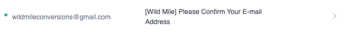

# Testing

#### [<< Return to Readme](https://github.com/jamie120/ms4-wild-mile/blob/master/README.md)

## Contents

1. [Manual Testing](#manual-testing)
2. [DevTools](#devtools)
3. [Automated Testing](#automated-testing)
    * [Code Validation](#code-validation)
    * [Browser Validation](#browser-validation)
4. [User Stories](#user-stories)
5. [User Testing](#user-testing)
    * [My Mentor](#my-mentor)
    * [User review](#user-review)
6. [Post Review Changes](#post-review-changes)

# Manual Testing

### **The following checks were completed on all browsers, any issues have been captured and documented below with screenshots.**

 
**

Sitewide
**

+ [Navbar & Banner](#navbar-and-banner)
+ [Footer](#footer)
+ [Search bar](#search-bar)
    

**

Home / About / Faq
**

+ [Home Page](#home-page)
+ [About](#about-page)
+ [FAQ](#faq-page)
    

**

Authorisation
**

+ [Sign In / Logout](#sign-in-and-logout)
+ [Register](#register)
+ [Allauth templates](#allauth-templates)
    

**

Conversions
**

+ [Conversions Page](#conversions-page)
+ [Conversion Detail Page](#conversion-detail-page)
+ [Save to Profile Feature](#save-to-profile-feature)
+ [Add a conversion Page](#add-conversion-page)
+ [Edit conversion Page](#edit-conversion-page)
+ [Delete conversion function](#delete-conversion-function)
+ [Listing token Page](#listing-token-page)

### Testing completed using the following browsers: 

* Google Chrome (Version 87.0.4280.88) using MacOS on a monitor running at 1920 x 1080.
* Safari (Version 11.1.2 (13605.3.8)) using MacOS on a monitor running at 1920 x 1080.
* Apple iPad Pro 11" -  Safari and Google Chrome - latest build at 29/01/2021.
* Apple iPhone X - Safari and Google Chrome - latest build at 29/01/2021.

#  **Sitewide**

### Navbar and Banner

* Verify hover effects are present on all nav links - :white_check_mark:
* Check all links in the nav element direct users to expected pages - :white_check_mark:
* Check all links in the mobile nav element direct users to the expected pages - :white_check_mark:
* Verify login and register links remove once a user is logged into the site - :white_check_mark:
* Verify admin/superuser specific links appear in 'My Account' dropdown - :white_check_mark:
* Verify scrolling banner displays and is animated - :white_check_mark:

### Footer
* Verify social icons link to the corresponding social media websites and that they open in a new window when clicked :white_check_mark:
* Verify the year is rendered as the current year in the copyright caption :white_check_mark:

### Search Bar
* Check an existing search term to achieve render the conversions template with search query applied - :white_check_mark:
 

* Check a non-existent search term to render the conversions template with search query applied - :white_check_mark:
 

# **Home Page**
* Verify the page loads responsively on all device sizes. - :white_check_mark:
* Verify site-entry overlay only loads on the intital page and does NOT load if refreshed in the same browser tab. :white_check_mark:
* Verify When clicked the site-overlay fades (1500ms) and the element is removed - :white_check_mark:
* Verify the 'grow' animation on the logo in the site-overlay functions as expected - :white_check_mark:
* Check all links in index.html direct users to the correct routes - :white_check_mark:

# **About Page**
* Verify the page loads responsively on all device sizes. - :white_check_mark:
* Verify images load as expected and scale accordingly based on browser - :white_check_mark:

# **FAQ Page**
* Verify the page loads responsively on all device sizes. - :white_check_mark:
* Verify questions are clickable, to toggle display of relevant answers to users. -:white_check_mark:

# **Sign In and Logout**
* Verify pages load as expected and responsively on all device sizes. - :white_check_mark:
* Check all links operate as required -:white_check_mark:

### Sign in and logout Fixes
- Remove home link from sign in page - Not required

# **Register**
* Check signup process functions as expected, including verification email being sent to a new user - :white_check_mark:
* Verification email received - :white_check_mark:
* User Confirmed - :white_check_mark:

    
    
     

# **Allauth templates**
* Check page styling is adjusted for all templates provided from allauth, to match the site theme -:x:

### Allauth template Fixes
- Various templates do not contain white text or appropriate margin and padding - AMEND AS REQUIRED

# **Conversions Page**
* Verify the page loads responsively on all device sizes. - :white_check_mark:

* Check all buttons/links function as expected :
    1. Filter category buttons - :white_check_mark:
    2. View Details button - :white_check_mark:
    3. Save to Profile button - :white_check_mark:
    4. Sort by dropdown - :white_check_mark:
    5. Pagination links - :white_check_mark:
    6. Back to top link - :white_check_mark:
    7. Carousel controls - :white_check_mark:

* Verify pagination is active, four listings (max) are present per page - :white_check_mark:

* Verify carousel displays the listings first three images :white_check_mark:

# **Conversion Detail Page**

* Verify the page loads responsively on all device sizes. - :white_check_mark:

* Check all buttons/links function as expected :
    1. Contact Seller button - :white_check_mark:
    2. Save to profile button - :white_check_mark:
    3. Image links open in new tab - :white_check_mark:
    4. Back to conversions link - :white_check_mark:
    5. Back to top link - :white_check_mark:
    6. Carousel controls - :white_check_mark:

* Verify 'inactive' listing can only be viewed by listing owner or admin - :white_check_mark:

    

* Verify 'inactive' listing is labelled to admin and listing owner - :white_check_mark:

    

## Images
* CSS image grid displays 6 conversion images in the bottom section of the page (viewports 768px and above) -:white_check_mark:
* Verify listings with more than six images have an owl-carousel element with controls rendered below the CSS image grid :x:
* Verify the owl-carousel contains ALL listing images with controls on viewports below 768px, the CSS image grid is not displayed :white_check_mark:

## Conversion Detail Fixes

* Add 'owl-carousel' controls on viewports larger than 767px

# **Save to Profile Feature**

* Verify only registered users can use the save to profile feature (users will be prompted to sign in) -:white_check_mark:
* Verify listings can only be added to the user profile once (toast messages provide feedback to user) - :white_check_mark:
    

    

    

# **Add Conversion Page**
* Verify the page loads responsively on all device sizes. - :white_check_mark:
* Verify only logged in users can access the 'add_conversion' template -:white_check_mark:
* Verify links work as expected 
    * Go to profile - :white_check_mark:
    * View listing token - :white_check_mark:
* Verify form validation prevents user from submitting the form with errors -:white_check_mark:
* Verfify that once the form is submitted and validated, the user is redirected to the newly created listing - rendering the conversion_detail template -:white_check_mark: 
* Verify the newly created listing is NOT active -:white_check_mark:
* Verify the newly created listing is viewable in the user profile 'my_listings' template :white_check_mark:

# **Edit Conversion Page**
* Verify the page loads responsively on all device sizes. - :white_check_mark:
* Verify users can only access the 'edit_conversion' template for listings which they have previously created (exception - Admin/superuser can edit all listings) -:white_check_mark:
* Verify 'back-to' link is dynamically rendered to the template:
    * Admin/Superuser - BACK TO CONVERSION MANAGEMENT -:white_check_mark:
    * Listing creator - BACK TO MY LISTINGS -:white_check_mark:
* Check all listing content is rendered to the form, ready for a user to edit -:white_check_mark:
* Check all images have the ability to 'delete' if desired -:white_check_mark:
* Check that three NEW image upload elements are present at the bottom of the form -:white_check_mark:
* Verify users are able to add/remove/update image files and save changes -:x:

## Edit form fixes
* It is not possible to update an image file if the delete checkbox is active - add note to users in the form

# **Delete Conversion Function**
* Verify users may request deletion only of listings which they have previously created (exception - Admin/superuser can delete all listings) -:white_check_mark:
* Verify a modal to confirm deletion is displayed to the user before commencing with deletion of listing -:white_check_mark:
* Verfify listings are deleted from the database once the process is confirmed and completed -:white_check_mark:

# **Listing Token Page**
* Verify the page loads responsively on all device sizes. - :white_check_mark:
* Verify links work as expected 
    * Standard Listing - :white_check_mark:
    * Extended Listing (disabled) - :white_check_mark:
    * Quarterly Listing (disabled) - :white_check_mark:

----------------------------
----------------------------
----------------------------
----------------------------
----------------------------
CONTINUE BELOW - COMPLETED UP TO THIS POINT

----------------------------
----------------------------
----------------------------
----------------------------
----------------------------

# **DevTools**

Google DevTools was used within Google Chrome on macOS throughout the development process. 

* Testing responsiveness of the site across several device models. 
    * Media queries are written accordingly to support major devices available in dev tool testing environment.

* Target elements and style with CSS, to test potential changes before coding them into relevant HTML.

* Console used to support the development of JavaScript code.
    * console.log used at various points to check values of variables and function outputs, whilst developing logic for site.
    * Upon site completion - the console was checked for any errors
    * Once the site was completed, the console was checked for any errors on each page :white_check_mark:

# **Automated Testing**

## Validating the HTML, CSS and JS code

All of my code passed the following validation tests/services:
- HTML: [W3C Markup Validation Service](https://validator.w3.org/)
- CSS: [W3C Markup Validation Service](https://jigsaw.w3.org/css-validator/)
- HTML & CSS [Dead Link Checker](https://www.deadlinkchecker.com/website-dead-link-checker.asp)
- JS: [jshint](https://jshint.com/)

* There were various HTML and CSS validation issues to resolve. These mainly referred to formatting my code and were easily fixable across the site.

# **User Stories**

#### User Story 1
##### As a visitor to the site, I want to easily find a recipe for lunch and dinner. The recipe should have reviews.

* Upon visiting the site it was clear to me which recipes had been recommended most times, as there was a top recipe panel on the home page. It also indicated the type of meal it was. ie: lunch or dinner.
* The navbar was easily found and contained links to show only recipes from a certain category, this helped me find a recipe much quicker. 
* Each recipe had a comments section at the bottom of its page. This helped me decide if I should try to cook the recipe myself.

#### User Story 2
##### As a visitor to the site, I want to share one of my favourite vegan recipes with others.

* The home page indicates to me as a user, that the site is a place to share recipes. I am presented with a get started button upon visiting the site, which prompts me to make an account with 'Eat Vegan'. Upon signing up I am taken to the recipes page, at the bottom of which there is an 'add recipe' button.
* At the bottom of the home page, there is a message informing me as a user 'Sign up to Eat Vegan, to add and review our recipes', alongside a button to 'Get Started'.
* Once signing up, these buttons took me to an add-recipe form. The form was simple and easy to use, it was clear what information was required.

#### User Story 3
##### As a visitor to the site, I want to search for a light snack to make for some Vegan friends.

* Upon vising the site, I was presented with a link to see all recipes. This took me to a page full of different recipes.
* I was able to select lunch as a filter for the recipes, this made it easy to find a suitable meal. 
* I know that my friends enjoy avocado, I was able to search for a recipe containing avocado easily.

#### User Story 4
##### As a previous visitor to the site, I want to edit a recipe that I added to the site on a previous visit.

* Upon revisiting the site, I was able to search for the recipe I added easily.
* To edit the recipe, I had to be logged in. Although this was not clear initially.
* Once logged in, two buttons appeared below the recipe image, edit and delete the recipe.
* Once clicked, the edit recipe form appears with all the recipe information populated. I was able to easily edit the details and hit 'submit changes' at the bottom of the page. The recipe updated immediately.

#### User Story 5
##### As a previous visitor to the site, I want to review a recipe that I cooked last week. It would be good to be able to search for the recipe, as I remember the name of it.

* Upon visiting the site, I searched for the recipe I had cooked earlier in the week. 
* At the bottom of the page, a banner informed me that I should 'Sign up to add and review recipes'.
* I clicked the 'get started' button, which was next to this message.
* I easily signed up and relocated myself to the recipe, where I now found an 'add comment and rating' section at the bottom of the page. 
* I was easily able to rate the recipe out of 5 and leave a comment. Which was added to the page once I clicked 'Add Comment & Rating'. 
* I could also see a 'delete' button next to my newly added comment. It would be good if I could also edit this comment if I desired to do so.

# User Testing

## My-Mentor

A series of feedback and suggestions had been highlighted during a call on Saturday 30th January 2021. Action has been taken for all of these suggestions and changes to the site and code. 

All changes are documented in Section 6 of this document (Post Review Changes)

## **User Testing**

All changes are documented in Section 6 of this document (Post Review Changes)

# Post Review Changes

* The following was addressed post-testing and feedback. (changes are detailed in commit history dated 15/04/2021 onwards) :
    1. Remove sitewide search functionality for conversions - implement function into conversions page only.
    2. Add search function to merchandise/products page.
    3. Add further conditional coding to site navigation, to improve user experience.
    4. Combine manage conversions and approve conversions pages, to create one dynamic page for displaying listings to site admin.
    5. Make fixed height cards in 'my_listings' and 'saved_listings' templates.
    6. Add confirm delete modals for merchandise and products throughout the site.
    7. Remove home link from sign in page.
    8. Adjust z-index on 'my-account' dropdown menu, to fix issue when empty toast messages element was preventing use of nav dropdown upon sign in.
    9. Create error handling templates for 400,403,404,500 errors.
