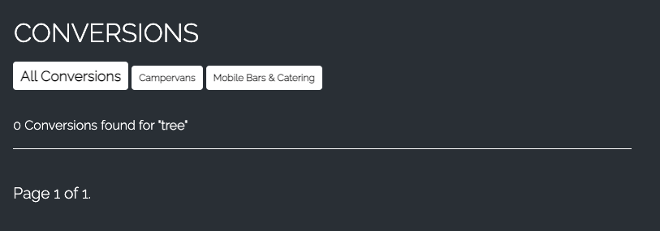

# Testing

#### [<< Return to Readme](https://github.com/jamie120/ms4-wild-mile/blob/master/README.md)

## Contents

1. [Manual Testing](#manual-testing)
2. [DevTools](#devtools)
3. [Automated Testing](#automated-testing)
    * [Code Validation](#code-validation)
    * [Browser Validation](#browser-validation)
4. [User Stories](#user-stories)
5. [User Testing](#user-testing)
    * [My Mentor](#my-mentor)
    * [User review](#user-review)
6. [Post Review Changes](#post-review-changes)

# Manual Testing

### **The following checks were completed on all browsers, any issues have been captured and documented below with screenshots.**

 
**

Sitewide
**

+ [Navbar & Banner](#navbar-and-banner)
+ [Footer](#footer)
+ [Search bar](#search-bar)
    

**

Home / About / Faq
**

+ [Home Page](#home-page)
+ [About](#about-page)
+ [FAQ](#faq-page)
    

**

Authorisation
**

+ [Sign In / Logout](#sign-in-and-logout)
+ [Register](#register)
+ [Allauth templates](#allauth-templates)
    

**

Conversions
**

+ [Conversions Page](#conversions-page)
+ [Conversion Detail Page](#conversion-detail-page)
+ [Save to Profile Feature](#save-to-profile-feature)
+ [Add a conversion Page](#add-conversion-page)
+ [Edit conversion Page](#edit-conversion-page)
+ [Delete conversion function](#delete-conversion-function)
+ [Listing token Page](#listing-token-page)

**

Merchandise
**

+ [Merchandise Page](#merchandise-page)
+ [Product Detail Page](#product-detail-page)
+ [Add Product Page](#save-to-profile-feature)
+ [Edit Product Page](#add-conversion-page)

**

Bag / Checkout
**

+ [Shopping Bag Page](#shopping-bag-page)
+ [Checkout Page](#checkout-page)
+ [Checkout Success Page](#checkout-success-page)

**

Profiles
**

+ [My Profile Page](#my-profile-page)
+ [Order History Page](#order-history-page)
+ [My Listings Page](#my-listings-page)
+ [Saved Listings Page](#saved-listings-page)

**

Management Pages
**

+ [Conversion Management Page](#conversion-management-page)

### Testing completed using the following browsers: 

* Google Chrome (Version  88.0.4324.192) using MacOS on a monitor running at 1920 x 1080.
* Safari (Version 14.0.3 (16610.4.3.1.4)) using MacOS on a monitor running at 1920 x 1080.
* Apple iPad Pro 11" -  Safari and Google Chrome.
* Apple iPhone X - Safari and Google Chrome.

#  **Sitewide**

### Navbar and Banner

* Verify hover effects are present on all nav links - :white_check_mark:
* Check all links in the nav element direct users to expected pages - :white_check_mark:
* Check all links in the mobile nav element direct users to the expected pages - :white_check_mark:
* Verify login and register links remove once a user is logged into the site - :white_check_mark:
* Verify admin/superuser specific links appear in 'My Account' dropdown - :white_check_mark:
* Verify scrolling banner displays and is animated - :white_check_mark:

### Footer
* Verify social icons link to the corresponding social media websites and that they open in a new window when clicked :white_check_mark:
* Verify the year is rendered as the current year in the copyright caption :white_check_mark:

### Search Bar
* Check an existing search term to achieve render the conversions template with search query applied - :white_check_mark:
 

* Check a non-existent search term to render the conversions template with search query applied - :white_check_mark:
 

# **Home Page**
* Verify the page loads responsively on all device sizes. - :white_check_mark:
* Verify site-entry overlay only loads on the intital page and does NOT load if refreshed in the same browser tab. :white_check_mark:
* Verify When clicked the site-overlay fades (1500ms) and the element is removed - :white_check_mark:
* Verify the 'grow' animation on the logo in the site-overlay functions as expected - :white_check_mark:
* Check all links in index.html direct users to the correct routes - :white_check_mark:

# **About Page**
* Verify the page loads responsively on all device sizes. - :white_check_mark:
* Verify images load as expected and scale accordingly based on browser - :white_check_mark:

# **FAQ Page**
* Verify the page loads responsively on all device sizes. - :white_check_mark:
* Verify questions are clickable, to toggle display of relevant answers to users. -:white_check_mark:

# **Sign In and Logout**
* Verify pages load as expected and responsively on all device sizes. - :white_check_mark:
* Check all links operate as required -:white_check_mark:

### Sign in and logout Fixes
- Remove home link from sign in page - Not required

# **Register**
* Check signup process functions as expected, including verification email being sent to a new user - :white_check_mark:
* Verification email received - :white_check_mark:
* User Confirmed - :white_check_mark:

    
    
     

# **Allauth templates**
* Check page styling is adjusted for all templates provided from allauth, to match the site theme -:x:

### Allauth template Fixes
- Various templates do not contain white text or appropriate margin and padding - AMEND AS REQUIRED

# **Conversions Page**
* Verify the page loads responsively on all device sizes. - :white_check_mark:

* Check all buttons/links function as expected :
    1. Filter category buttons - :white_check_mark:
    2. View Details button - :white_check_mark:
    3. Save to Profile button - :white_check_mark:
    4. Sort by dropdown - :white_check_mark:
    5. Pagination links - :white_check_mark:
    6. Back to top link - :white_check_mark:
    7. Carousel controls - :white_check_mark:

* Verify pagination is active, four listings (max) are present per page - :white_check_mark:

* Verify carousel displays the listings first three images :white_check_mark:

# **Conversion Detail Page**

* Verify the page loads responsively on all device sizes. - :white_check_mark:

* Check all buttons/links function as expected :
    1. Contact Seller button - :white_check_mark:
    2. Save to profile button - :white_check_mark:
    3. Image links open in new tab - :white_check_mark:
    4. Back to conversions link - :white_check_mark:
    5. Back to top link - :white_check_mark:
    6. Carousel controls - :white_check_mark:

* Verify 'inactive' listing can only be viewed by listing owner or admin - :white_check_mark:

    

* Verify 'inactive' listing is labelled to admin and listing owner - :white_check_mark:

    

## Images
* CSS image grid displays 6 conversion images in the bottom section of the page (viewports 768px and above) -:white_check_mark:
* Verify listings with more than six images have an owl-carousel element with controls rendered below the CSS image grid :x:
* Verify the owl-carousel contains ALL listing images with controls on viewports below 768px, the CSS image grid is not displayed :white_check_mark:

## Conversion Detail Fixes

* Add 'owl-carousel' controls on viewports larger than 767px

# **Save to Profile Feature**

* Verify only registered users can use the save to profile feature (users will be prompted to sign in) -:white_check_mark:
* Verify listings can only be added to the user profile once (toast messages provide feedback to user) - :white_check_mark:
    

    

    

# **Add Conversion Page**
* Verify the page loads responsively on all device sizes. - :white_check_mark:
* Verify only logged in users can access the 'add_conversion' template -:white_check_mark:
* Verify links work as expected 
    * Go to profile - :white_check_mark:
    * View listing token - :white_check_mark:
* Verify form validation prevents user from submitting the form with errors -:white_check_mark:
* Verfify that once the form is submitted and validated, the user is redirected to the newly created listing - rendering the conversion_detail template -:white_check_mark: 
* Verify the newly created listing is NOT active -:white_check_mark:
* Verify the newly created listing is viewable in the user profile 'my_listings' template :white_check_mark:

# **Edit Conversion Page**
* Verify the page loads responsively on all device sizes. - :white_check_mark:
* Verify users can only access the 'edit_conversion' template for listings which they have previously created (exception - Admin/superuser can edit all listings) -:white_check_mark:
* Verify 'back-to' link is dynamically rendered to the template:
    * Admin/Superuser - BACK TO CONVERSION MANAGEMENT -:white_check_mark:
    * Listing creator - BACK TO MY LISTINGS -:white_check_mark:
* Check all listing content is rendered to the form, ready for a user to edit -:white_check_mark:
* Check all images have the ability to 'delete' if desired -:white_check_mark:
* Check that three NEW image upload elements are present at the bottom of the form -:white_check_mark:
* Verify users are able to add/remove/update image files and save changes -:x:

## Edit form fixes
* It is not possible to update an image file if the delete checkbox is active - add note to users in the form

# **Delete Conversion Function**
* Verify users may request deletion only of listings which they have previously created (exception - Admin/superuser can delete all listings) -:white_check_mark:
* Verify a modal to confirm deletion is displayed to the user before commencing with deletion of listing -:white_check_mark:
* Verfify listings are deleted from the database once the process is confirmed and completed -:white_check_mark:

# **Listing Token Page**
* Verify the page loads responsively on all device sizes. - :white_check_mark:
* Verify links work as expected 
    * Standard Listing - :white_check_mark:
    * Extended Listing (disabled) - :white_check_mark:
    * Quarterly Listing (disabled) - :white_check_mark:

# **Merchandise Page**
* Verify the page loads responsively on all device sizes. - :white_check_mark:
* Verify links work as expected 
    1. Filter category buttons - :white_check_mark:
    2. View Product Details (product card) - :white_check_mark:
    3. Edit product button (visible to admin/superuser only) - :white_check_mark:
    4. Delete product button (visible to admin/superuser only) - :white_check_mark:
    5. Sort by dropdown - :white_check_mark:
    6. Back to top link - :white_check_mark:

# **Product Detail Page**
* Verify the page loads responsively on all device sizes. - :white_check_mark:
* Verify links/buttons work as expected 
    1. Keep Shopping - :white_check_mark:
    2. Add to bag - :white_check_mark:
    3. Product Image (opens in new tab - large) - :white_check_mark:
    4. Product quantity buttons (not able to reduce quantity to below 1) - :white_check_mark:
    5. Edit product button (visible to admin/superuser only) - :white_check_mark:
    6. Delete product button (visible to admin/superuser only) - :white_check_mark:
* Verify sizes dropdown is rendered for products which include sizes -:white_check_mark:

## Product Detail - Listing Token
* Verfiy 'inactive' listings dropdown is rendered if product is a listing token -:white_check_mark:
* Verify quantity buttons are removed for 'listing token' product -:white_check_mark:
* Verfify quantity of item cannot be manual adjusted from the default of 1 -:white_check_mark:
* Verify 'keep shopping' button is changed to 'back to listing levels' button -:white_check_mark:

# **Add Product Page**
* Verify the page loads responsively on all device sizes. - :white_check_mark:
* Verify only logged admin/superusers can access the 'add_product' template -:white_check_mark:
* Verify form validation prevents user from submitting the form with errors -:white_check_mark:
* Verfify that once the form is submitted and validated, the user is redirected to the newly created product - rendering the product_detail template -:white_check_mark: 

# **Edit Product Page**
* Verify the page loads responsively on all device sizes. - :white_check_mark:
* Verify only superusers can access the 'edit_product' template for -:white_check_mark:
* Check all product content is rendered to the form, ready for a superuser to edit -:white_check_mark:
* Verfify the 'clear' image checkbox works as expected if checked when the form is submitted. -:white_check_mark:
* Verify that once the form is submitted, the user is redirected to the product_detail template for the recently updated product -:white_check_mark:

# **Shopping Bag Page**
* Verify the page loads responsively on all device sizes. - :white_check_mark:
* Verify all session bag contents render to the shopping bag template -:white_check_mark:
* Verify totals and delivery is accurately calculated and displayed to the user -:white_check_mark:
* Verify links/buttons work as expected
    1. Product quantity buttons (cannot be reduced below 1) -:white_check_mark:
    2. Update / Remove product buttons -:white_check_mark:
    3. Keep Shopping button -:white_check_mark:
    4. Secure checkout button -:white_check_mark:
* For listing tokens: -
    * Verify update button is removed -:white_check_mark:
    * Verify quantity cannot be adjusted -:white_check_mark:

# **Checkout Page**
* Verify the page loads responsively on all device sizes. - :white_check_mark:
* Verify the order summary displays as expected -:white_check_mark:
* User details populate from userprofile (default delivery info, name and email) if registered user -:white_check_mark:
* Save delivery infomation checkbox - if checked form data is added/updated to user profile -:white_check_mark:
* Stripe card element verification/validation works as expected -:white_check_mark:
* Verify buttons work as expected
    1. Adjust bag (returns user to shopping bag) -:white_check_mark:
    2. Complete Order (generates order, redirects to checkout_success) -:white_check_mark:
* If bag total is £0.00 -
    1. Stripe element is not present on the page (checkout_free template rendered) - payment not required to complete order -:white_check_mark:

# **Checkout Success Page**
* Verify the page loads responsively on all device sizes. - :white_check_mark:
* Verify the order details displayed are as expected -:white_check_mark:
* Verify all links work as expected -:white_check_mark:

# **My Profile Page**
* Verify the page loads responsively on all device sizes. - :white_check_mark:
* Verify all links to other profile pages work as expected -:white_check_mark:
* Default delivery information is displayed in the rendered form, if present.
* Verify the 'update information' feature works as expected for the default delivery information -:white_check_mark:

# **Order History Page**
* Verify the page loads responsively on all device sizes. - :white_check_mark:
* Verfify all previous orders associated with the userprofile display on this page -:white_check_mark:
* Verify order number links work as expected, rendering checkout_success template with corresponding order details -:white_check_mark:

# **My Listings Page**
* Verify the page loads responsively on all device sizes. - :white_check_mark:
* Verify all listings created by the user, are displayed within card elements on this page -:white_check_mark:
* Verify all buttons on listing cards work as expected 
    1. Goto listing(conversion_detail template) -:white_check_mark:
    2. Edit listing(edit_conversion template) -:white_check_mark:
    3. Delete listing(delete_conversion function) -:white_check_mark:
* Verify the listing status is displayed to the user in the card footer 
    1. Active listing (green text) -:white_check_mark:
    2. Inactive listing (orange text + button to view pricing) -:white_check_mark:

# **Saved Listings Page**
* Verify the page loads responsively on all device sizes. - :white_check_mark:
* Verify all listings saved to the userprofile, are displayed within card elements on this page -:white_check_mark:
* Verify all buttons on listing cards work as expected 
    1. View Listing(conversion_detail template) -:white_check_mark:
    2. Remove Listing(remove_saved_listing function) -:white_check_mark:
* Verify the listing status is displayed to the user in the card footer if inactive - :white_check_mark:
* Verify listing cannot be viewed if inactive (View listing button disabled) -:white_check_mark

# **Conversion Management Page**
* Verify the page loads responsively on all device sizes. - :white_check_mark:
* Verify access to this template is limited to superusers only -:white_check_mark:
* Verify all conversion listings are able to be displayed on this template - Using the buttons 'Active Listings' & 'Awaiting Approval' the user will filter displayed content based on the listing status -:white_check_mark:
* Each listing summary is displayed in a card element.
* Card elements contain the following buttons in their footer, buttons function as expected:
    1. View Details (conversion_detail template) -:white_check_mark:
    2. Edit Conversion (edit_conversion template) -:white_check_mark:
    3. Delete Conversion (delete_conversion function) -:white_check_mark:
    4. Contact Seller (displays contact into the card element footer) -:white_check_mark:
    4. Delist / Approve listing (changes listing 'isactive' status) -:white_check_mark:

# **DevTools**

Google DevTools was used within Google Chrome on macOS throughout the development process. 

* Testing responsiveness of the site across several device models. 
    * Media queries are written accordingly to support major devices available in dev tool testing environment.

* Target elements and style with CSS, to test potential changes before coding them into relevant HTML.

* Console used to support the development of JavaScript code.
    * console.log used at various points to check values of variables and function outputs, whilst developing logic for site.
    * Upon site completion - the console was checked for any errors
    * Once the site was completed, the console was checked for any errors on each page :white_check_mark:

# **Automated Testing**

## Validating the HTML, CSS and JS code

All of my code passed the following validation tests/services:
- HTML: [W3C Markup Validation Service](https://validator.w3.org/)
- CSS: [W3C Markup Validation Service](https://jigsaw.w3.org/css-validator/)
- HTML & CSS [Dead Link Checker](https://www.deadlinkchecker.com/website-dead-link-checker.asp)
- JS: [jshint](https://jshint.com/)

* There were various HTML and CSS validation issues to resolve. These mainly referred to formatting my code and were easily fixable across the site.

# **User Stories**

## Viewing and Navigation
### User Story 1

### As a site visitor: View a list of products/conversions available
    
* The site navigation is clear and easily allows access to both merchandise and conversions listing pages.
* The home page has a call to action button - allowing users direct access to to conversion page, without the use of the navbar.  

### User Story 2

### As a site visitor: View individual product / listing details
    
* In the conversions listings page, each listing has a 'view details' button, it can be clicked to gain access to the conversion_detail template.
* Each product image in the merchandise listings can be clicked to gain access to the product_detail template

### User Story 3

### As a site visitor: Easily view my shopping bag with a total of my purchases at any time.

* In the top-nav element which is fixed to the top of each page, a shopping bag icon is present, it can be clicked to gain access to the bag template to view bag contents.

### User Story 4

### As a site visitor: Learn more about the business and services offered

* Upon visiting the site intitally, the site purpose is clearly displayed to users ('WILD MILE CONVERSIONS - A platform to buy and sell unique converted vehicles')
* A scrolling banner at the top of each page promotes services and news to keep the user informed.

## Registration and User Accounts

### User Story 5

### As a site visitor: Easily register for an account

* In the top-nav element, a my_account icon is displayed. When clicked a dropdown will display a link to register.
* Restricted areas of the site for registered users only, will prompt users to sign in or register and provide them with the relevant pages/information to achieve this.

### User Story 6

### As a site visitor: Easily login or logout of the site

* In the top-nav element, a my_account icon is displayed. When clicked a dropdown will display a link to login or to logout.

### User Story 7

### As a site visitor: Easily recover my password in case I forget it

* On the sign in page a 'forgot password' link will direct the user to input their registered email address, associated with their user account. A link will be emailed to the user to reset their password.

### User Story 8

### Receive an email confirmation after registering to verify my registration was successful

* Newly registered users will need to confirm their email address as part of the signup process. In order to validate their account, they will receive an email from wildmileconversions@gmail.com

### User Story 9

### As a registered user: Have a personalized user profile

* All registered users will have access to 'my_profile' template. This will contain information unique to their user profile, such as order history, saved listings, delivery information and more.

## Sorting and Searching

### User Story 10

### As a site visitor: Sort listings or products - Easily find listings based on price or category which fit my criteria

* Category filtering functionality is embedded into both conversions and merchandise pages, to allow users to display results of matching category criteria.
* Displayed products or listings can be sorted by name, price, category on the page. Merchandise can further be sorted by rating.

### User Story 11

### As a site visitor: Search for a listing using keywords - Easily see what I've searched for and the number of results

* A search bar is present on the conversions page, users may use this to search listing titles and descriptions. 
* The search will return all matching listings and display them on the page. As well as a summary of the search term and the amount of matches found.
* This feature has been extended to the merchandise products page.

### User Story 12 + 13

### As a registered user: Save a listing to my profile to easily view the listing at a later date from my profile

* Users can easily use the button 'save to profile' on any active listing on the site. The button is present on both the conversions template and the conversion_detail template.
* Users can easily manage all saved listings in their profile, in the 'saved_listings' page. Easily remove them from the save listings page, using the 'remove_listing' button.

## Selling as a registered user

### User Story 14

### As a registered user: List a conversion on the site Easily

* The site navigation offers users a direct link to 'sell a conversion'. 
* Adding a listing to the platform is completed using a single form, with clear instructions on the 'sell_conversion' template.

### User Story 15

### As a registered user: Receive an email when my conversion is submitted for approval, to verify my listing token has been recieved and the order confirmed

* The site will automatically generate an order summary during the checkout page. Clear instructions are 
* Adding a listing to the platform is completed using a single form, with clear instructions on the 'sell_conversion' template.

# User Testing

## My-Mentor

A series of feedback and suggestions had been highlighted during a call on Saturday 30th January 2021. Action has been taken for all of these suggestions and changes to the site and code. 

All changes are documented in Section 6 of this document (Post Review Changes)

## **User Testing**

All changes are documented in Section 6 of this document (Post Review Changes)

# Post Review Changes

* The following was addressed post-testing and feedback. (changes are detailed in commit history dated 15/04/2021 onwards) :
    1. Remove sitewide search functionality for conversions - implement function into conversions page only.
    2. Add search function to merchandise/products page.
    3. Add further conditional coding to site navigation, to improve user experience.
    4. Combine manage conversions and approve conversions pages, to create one dynamic page for displaying listings to site admin.
    5. Make fixed height cards in 'my_listings' and 'saved_listings' templates.
    6. Add confirm delete modals for merchandise and products throughout the site.
    7. Remove home link from sign in page.
    8. Adjust z-index on 'my-account' dropdown menu, to fix issue when empty toast messages element was preventing use of nav dropdown upon sign in.
    9. Create error handling templates for 400,403,404,500 errors.
